# Kotlin 版 WanAndroid 客户端

[//]: # ([![Platform][1]][2]  [![Build Status][3]][4]  [![Release][5]][6]  [![Release][7]][8]  [![GitHub license][9]][10]  [![][11]][12] )

[//]: # ()
[//]: # ([1]:https://img.shields.io/badge/platform-Android-blue.svg  )

[//]: # ([2]:https://github.com/iceCola7/WanAndroid)

[//]: # ()
[//]: # ([3]:https://travis-ci.com/iceCola7/WanAndroid.svg?branch=master)

[//]: # ([4]:https://travis-ci.com/iceCola7/WanAndroid)

[//]: # ()
[//]: # ([5]:https://img.shields.io/badge/API-16%2B-brightgreen.svg?style=flat)

[//]: # ([6]:https://android-arsenal.com/api?level=16)

[//]: # ()
[//]: # ([7]:https://img.shields.io/github/release/iceCola7/WanAndroid.svg)

[//]: # ([8]:https://github.com/iceCola7/WanAndroid/releases/latest)

[//]: # ()
[//]: # ([9]:https://img.shields.io/badge/license-Apache%202-blue.svg)

[//]: # ([10]:https://github.com/iceCola7/WanAndroid/blob/master/LICENSE)

[//]: # ()
[//]: # ([11]:https://img.shields.io/badge/QQ-563859095-orange.svg)

[//]: # ([12]:http://wpa.qq.com/msgrd?v=3&uin=563859095&site=qq&menu=yes)

[//]: # ()
[//]: # (- **Flutter 版 WANAndroid 客户端：[https://github.com/iceCola7/flutter_wanandroid]&#40;https://github.com/iceCola7/flutter_wanandroid&#41;**)

[//]: # (- **Kotlin 版 MVP 基础框架：[https://github.com/iceCola7/KotlinMVPSamples]&#40;https://github.com/iceCola7/KotlinMVPSamples&#41;**)

[//]: # (- **Java 版 MVP 基础框架：[https://github.com/iceCola7/MVPSamples]&#40;https://github.com/iceCola7/MVPSamples&#41;**)

[//]: # (- **Github 项目地址：[https://github.com/iceCola7/WanAndroid]&#40;https://github.com/iceCola7/WanAndroid&#41;**)

[//]: # ()
[//]: # (**开源不易，如果喜欢的话希望给个 `Star` 或 `Fork` ^_^ ，谢谢~~**)

## 前言
使用kotlin语言编写的玩Android项目的客户端。
项目使用了MVP+RxJava+Retrofit+EventBus等作为设计。
使用MVP架构使得项目结构清晰,具有强烈的MVP特色。
网络请求方面则是采用了RxJava+Retrofit的方式,通过RxJava线程调度和操作符功能轻松实现数据加载。

## API
[**玩 Android 开放 API**](http://www.wanandroid.com/blog/show/2)

## 项目截图

| 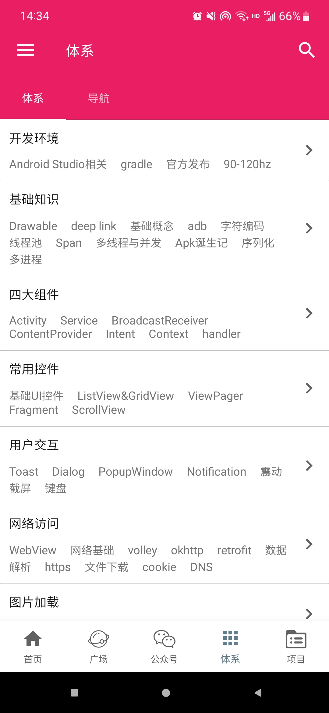 | 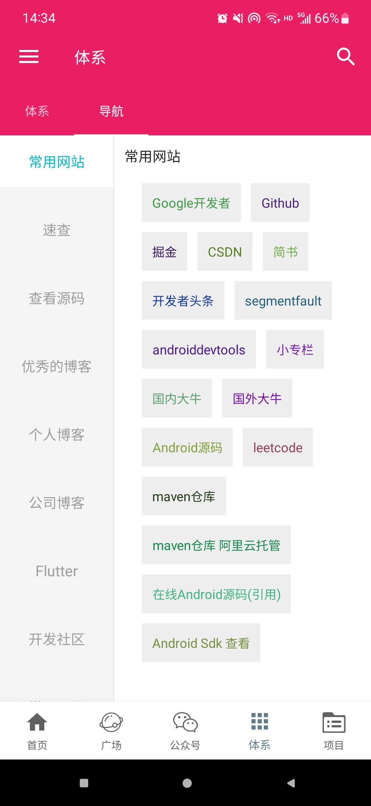 | 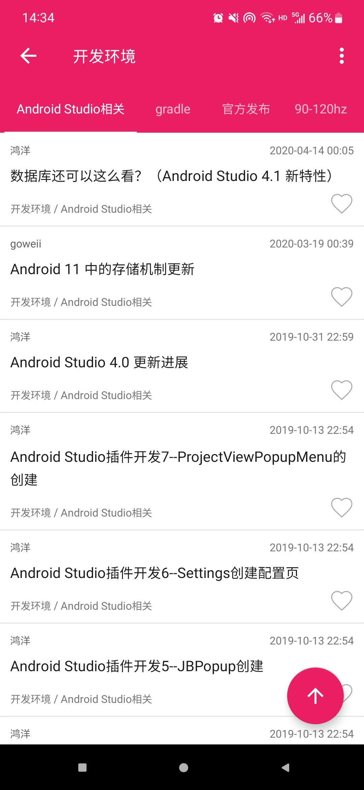 | 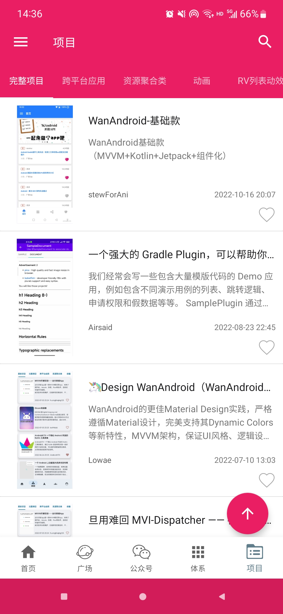 |
| --- | --- | --- | --- |
| 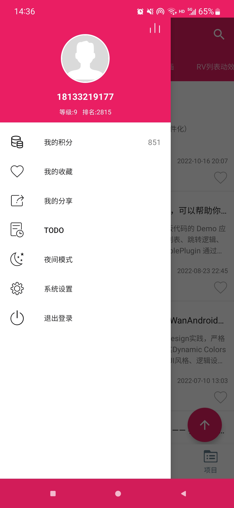 | 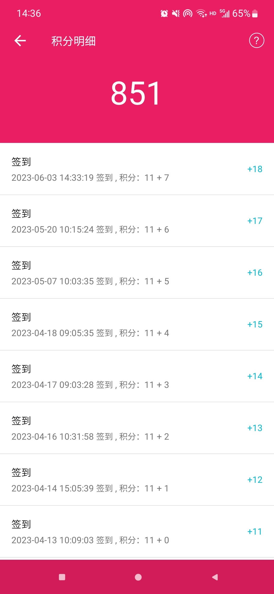 | 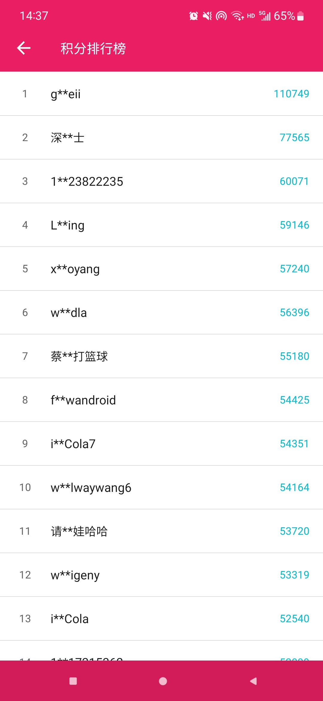 |  |
| 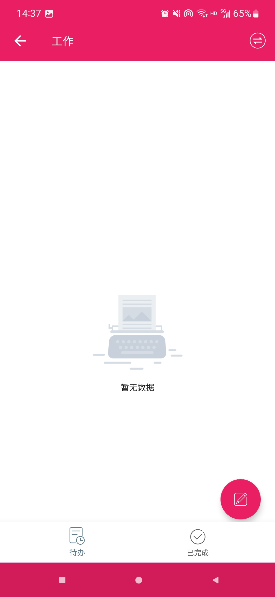 | 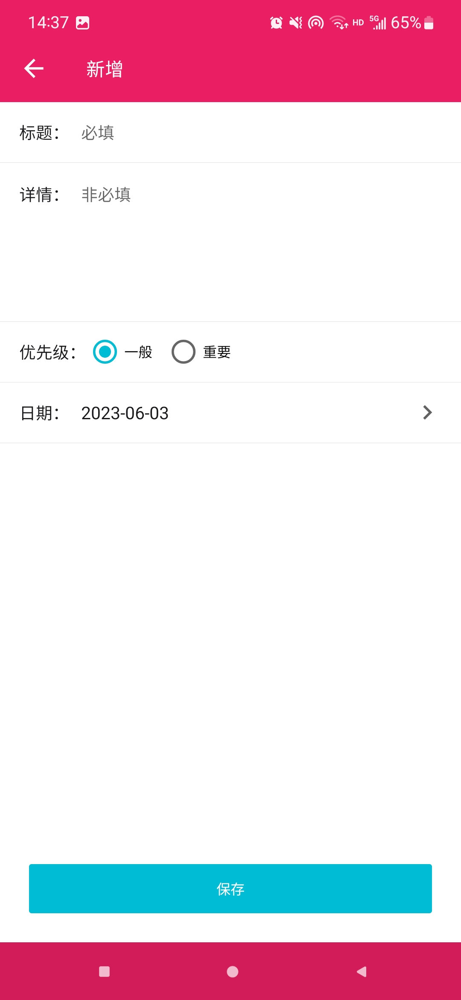 |  | 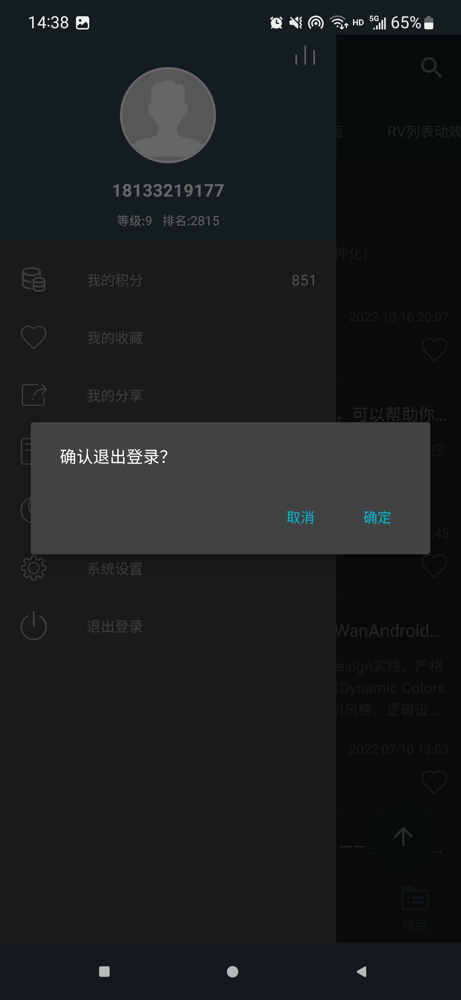 |
| 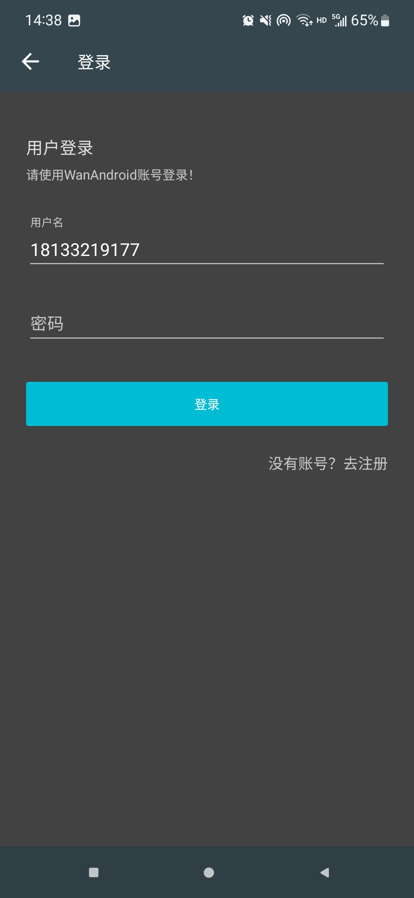 | 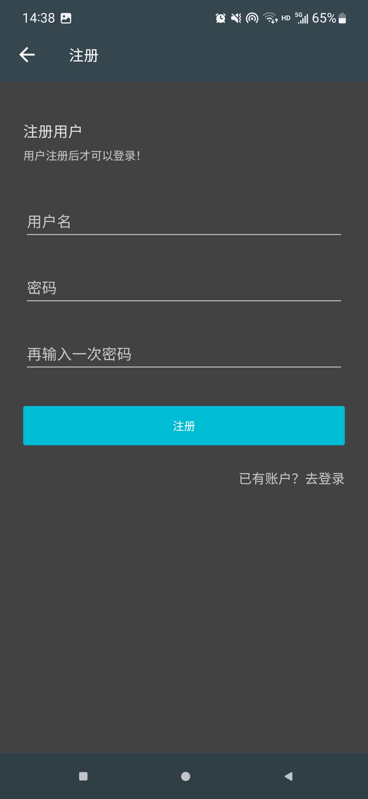 |

## 主要功能

- 首页、知识体系、公众号、导航、项目模块;
- 登录注册功能;
- 搜索功能:热门搜索、搜索历史;
- 收藏功能:添加收藏、取消收藏;
- 文章列表置顶功能;
- 浏览文章、分享文章、用浏览器打开文章;
- 个人积分、积分排行榜功能;
- TODO模块:新增待办、更新待办、查看待办、删除待办等功能;
- 夜间模式功能;
- 自动切换夜间模式功能;

