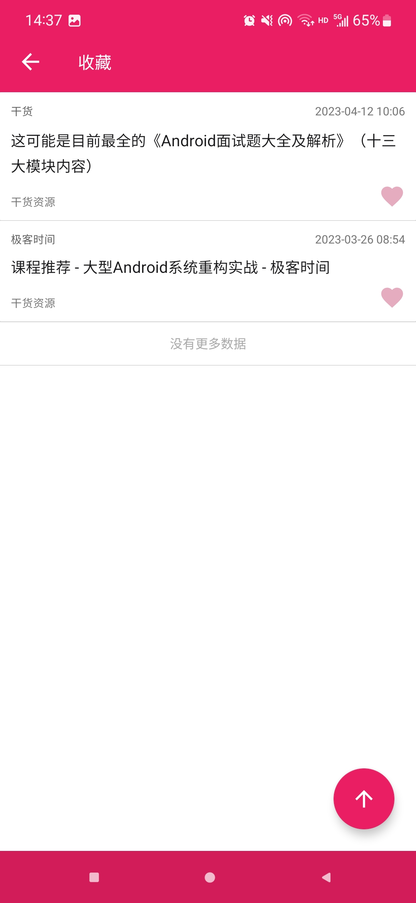
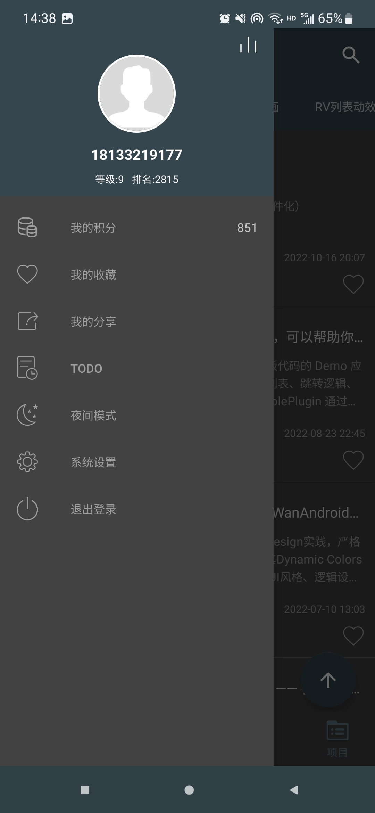

# Kotlin+MVP 版 WanAndroid 客户端

## 前言
使用kotlin语言编写的玩Android项目的客户端。
项目使用了MVP+RxJava+Retrofit+EventBus等作为设计。
使用MVP架构使得项目结构清晰,具有强烈的MVP特色。
网络请求方面则是采用了RxJava+Retrofit的方式,通过RxJava线程调度和操作符功能轻松实现数据加载。

## API
[**玩 Android 开放 API**](http://www.wanandroid.com/blog/show/2)

## 项目截图

|  |  |  |  |
|-----------------|-----------------|-----------------|-----------------|
|  |  |  |  |
|  |  |  |  |
|  |  |  |  |
|  |  |

## 主要功能

- 首页、知识体系、公众号、导航、项目模块;
- 登录注册功能;
- 搜索功能:热门搜索、搜索历史;
- 收藏功能:添加收藏、取消收藏;
- 文章列表置顶功能;
- 浏览文章、分享文章、用浏览器打开文章;
- 个人积分、积分排行榜功能;
- TODO模块:新增待办、更新待办、查看待办、删除待办等功能;
- 夜间模式功能;
- 自动切换夜间模式功能;

